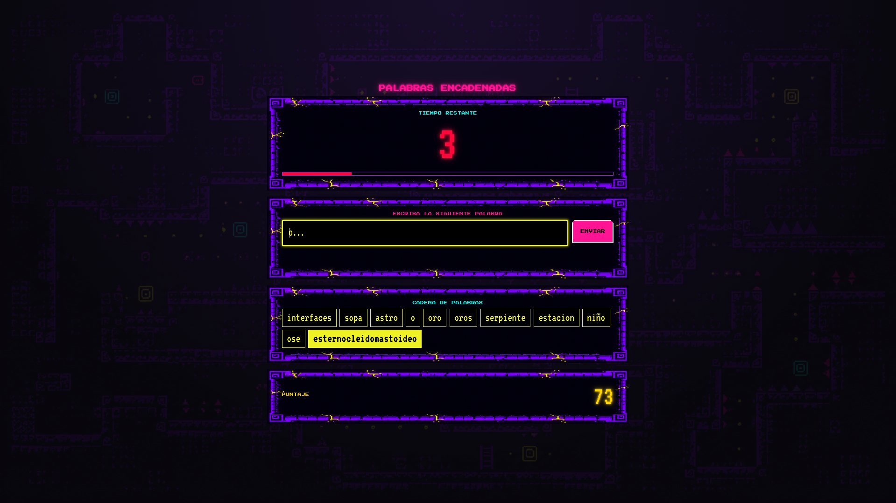
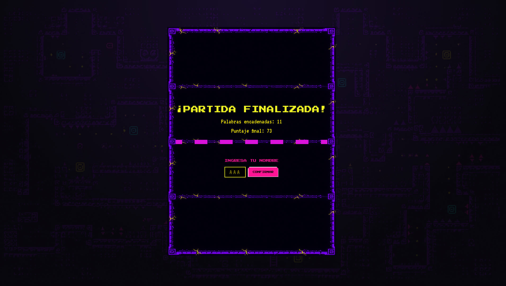
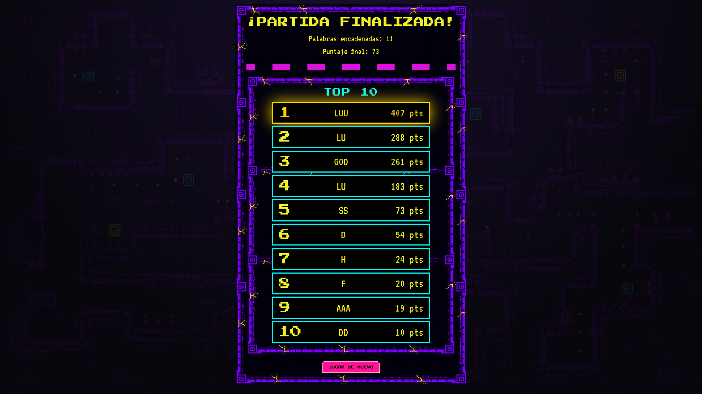

## CONSTRUCCION DE INTERFACES DE USUARIO - TRABAJO FINAL INTEGRADOR 2026s1

## PALABRAS ENCADENADAS:
El juego consiste en formar la mayor cantidad de palabras que se encuentren conectadas por su última letra, tenemos 15 segundos para pensar cada palabra, de lo contrario, perderemos. Sé el que mas puntos obtenga!

## ALUMNO:
Alderete Nicolás - Grupo 01

## REQUISITOS:

Tener NodeJS instalado
Poseer conexión a internet (Nuestra API valida desde la web)

## INSTALACIÓN:

1) CMD: Clona el repositorio desde el siguiente link: https://github.com/Nico4250/unq-ui-nicolas-alderete-trabajo-final.git
2) CMD: entra en la carpeta del repositorio: unq-ui-nicolas-alderete-trabajo-final
3) CMD: instala las dependencias: npm install
(Ya está listo para correr!)

## CÓMO JUGAR:
1) CMD: entra en la carpeta del repositorio: unq-ui-nicolas-alderete-trabajo-final
2) CMD: npm run dev
(Listo! Debería abrir el juego en: http://localhost:5173, asegurate de que tu pc no esté ocupando la ruta)

### Pantalla de juego

### Fin de partida

### Leaderboard

